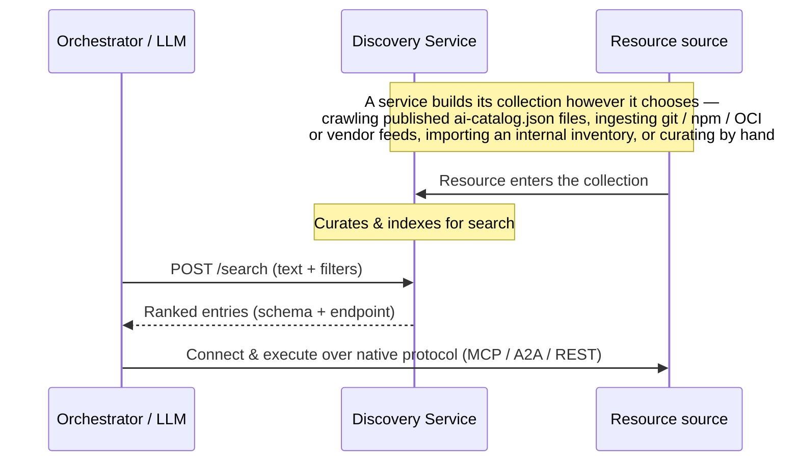

# Overview & Architecture

> Organizing agents, tools, and skills isn't really all that difficult, until you need to do so globally and with cryptographic trust guarantees.

The Agentic Resource Discovery Specification (ARD) is a lightweight, domain-anchored discovery specification. It defines how agentic resources — MCP servers, A2A cards, Skills, and traditional API tools — are cataloged, searched, and dynamically discovered across composable, federated networks of discovery services.

!!! note "ARD isn't run-time-only or open-ended-only"
    Discovery can run at **build time** (choosing which tools to wire into an agent) or at **run time** (an agent looking one up mid-task), and over a **curated, approved set** of tools or an **open, web-scale** index — the request is the same either way. In practice, **most enterprises will want the restricted case**: discovery scoped to a governed, approved set of tools, not the open web. ARD serves that just as directly as open-web discovery.

---

## 1. The scaling problem (prompt bloat)

Feeding every available agentic resource schema directly into a system prompt works fine when you have five tools. When you have five thousand, your context window vanishes, latency spikes, and the model's selection accuracy drops.

```
❌ Walled garden / prompt-stuffing:
[System Prompt] + [User Query] + [Tool A] + [Tool B] + [Tool C]... = Prompt Bloat

✅ Discovery-first (ARD):
[User Query] ──> [Discovery service (POST /search)] ──> [Top 3 agentic resources] ──> [LLM Context]
```

Instead of forcing the model to sort through the noise, ARD moves selection outside the active context window. The orchestrator queries a dedicated discovery service first, injecting only the top matching schemas into the final prompt.

---

## 2. How it differs from the "app store" model

ARD moves away from manually installed, hardcoded integrations toward dynamic runtime discovery.

| Vector | Centralized registries | ARD discovery services |
| :--- | :--- | :--- |
| **Discovery** | Manual registration / gatekeeper approval | Dynamic crawling and indexing (SEO for agents) |
| **Hosting** | Single central repository database | Self-hosted on publisher domains |
| **Lifecycle** | Hardcoded configs and manual installs | Discovered and connected at runtime |
| **Scope** | Restricted to a single protocol (e.g., MCP only) | Protocol-agnostic envelope (MCP, A2A, Skills) |

---

## 3. Decentralized trust (no central kingmakers)

Centralized directories create administrative bottlenecks and unilateral gatekeepers. ARD avoids this by anchoring logical names directly to DNS domains:

```text
urn:ai:acme.com:finance:trading
```

*   **Domain authority**: Because the namespace maps to a FQDN (`acme.com`), the publisher domain acts as the cryptographic trust root.
*   **Workload identity**: The domain binds directly to the host's cryptographic identity (like SPIFFE or `did:web`) in a local `trustManifest`.
*   **No walled gardens**: Anyone can index these URNs, verify their provenance, and run a discovery service without requiring a central naming committee.

---

## 4. The core mechanics

ARD operates on a simple envelope design using standard and proposed **IANA media types** (like `application/mcp-server+json` or `application/a2a-agent-card+json`) to wrap different protocols, delegating execution details to the underlying schemas.

A discovery service answers queries over a **collection it curates — and that collection can be assembled in many ways.** ARD standardizes how resources are *described* (the `ai-catalog.json` envelope) and *searched* (a REST interface); it does not dictate how a given service builds or ranks its collection.



1.  **Describe**: A resource is described with an AI Catalog entry. Publishers can advertise their `ai-catalog.json` in several ways — a `.well-known/ai-catalog.json` URI, an `Agentmap` directive in `robots.txt`, an HTML `<link rel="ai-catalog">`, or DNS records — but publishing is only one way a resource enters a collection.
2.  **Curate**: A discovery service builds its collection however it chooses. Every registry must support crawling published catalogs; beyond that, a registry may ingest other sources (git, npm, or OCI registries) or apply its own curation — internal inventories, vendor feeds, hand-picked lists — and index it for search by whatever method it likes.
3.  **Search**: Clients query a discovery service (`POST /search`) with natural-language text and optional structured filters, and get back the most relevant entries — each with its schema and endpoint.
4.  **Execute**: The client connects directly and runs the resource over its own protocol (MCP, A2A, REST…).
